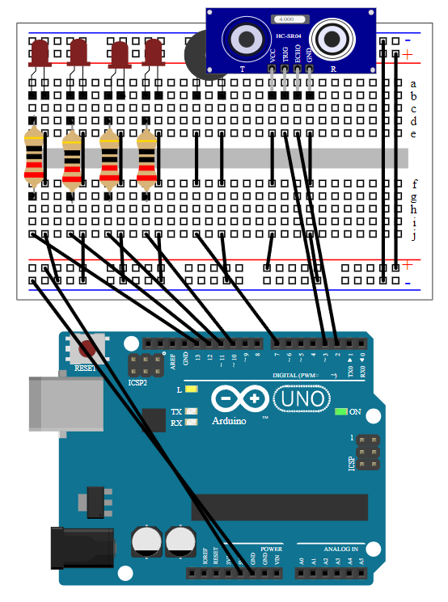

# `Arduino` sound and visual alarm


This is source code and build for `Arduino` sound and visual ultrasonic alarm

### Ultrasonic transponder based visual and sound alarm with configurable parameters

#### You can configure ports and water level limit in variables below:
```C++
#define SENSOR_TRIG_PIN 3
#define SENSOR_ECHO_PIN 2
#define BUZZER_PIN 7
#define TRIGGER_DISTANCE 50
#define LEDS_FROM_RANGE 9
#define LEDS_TO_RANGE 12
```

### Hardware that i've used:
- `Arduino UNO r3`
- HC-SRO4
- 4x Red LED
- 4x 220R resistor
- Buzzer
- Breadboard

### Software that i've used:
- `UNO r3 driver`
- `VScode`
- `PlatformIO`

### Circuit schema:
